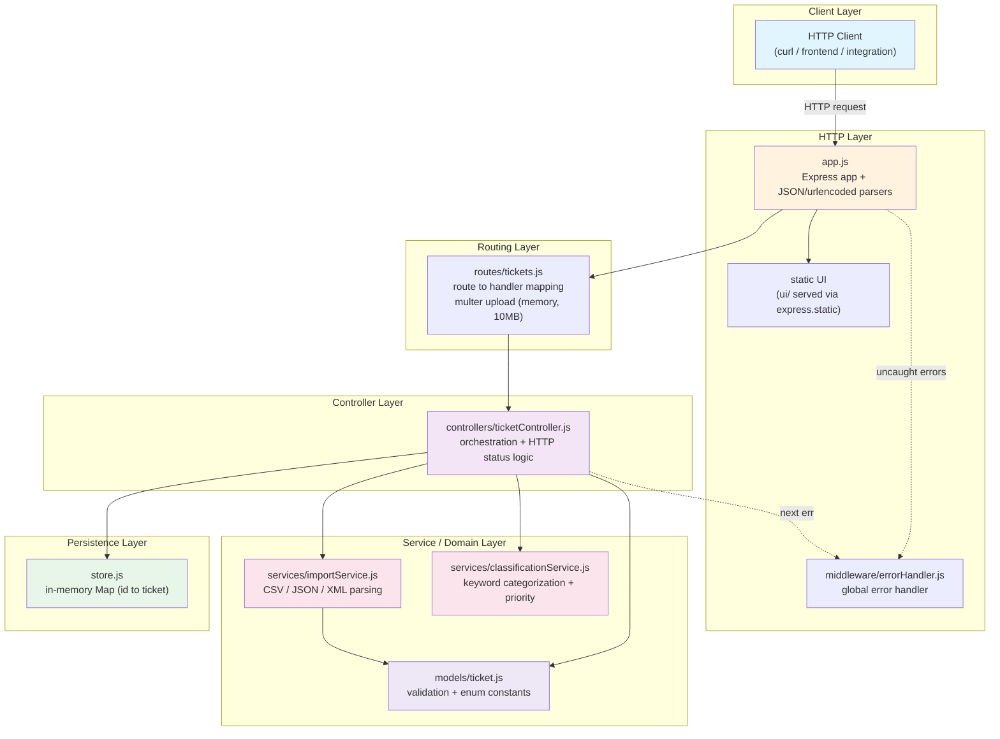
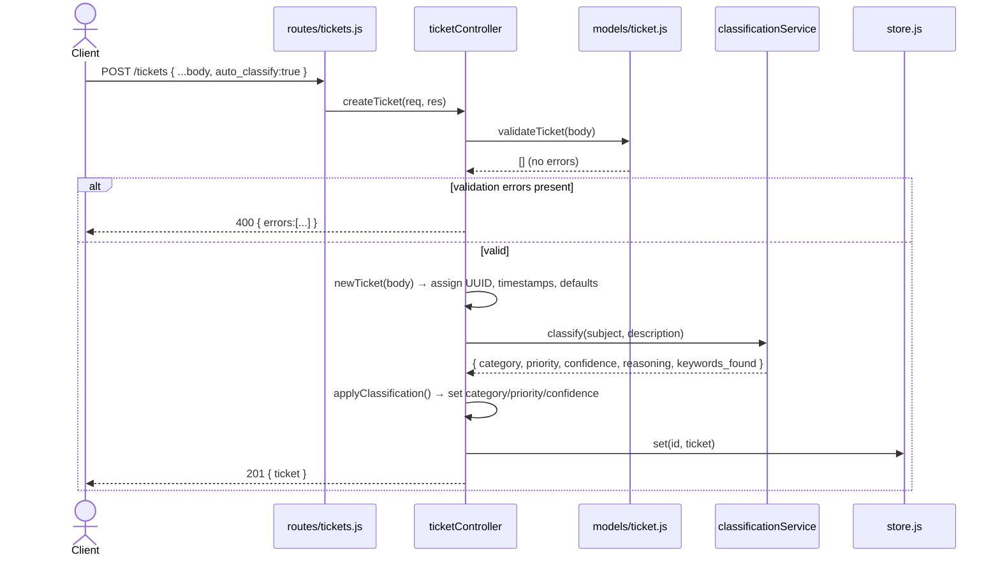
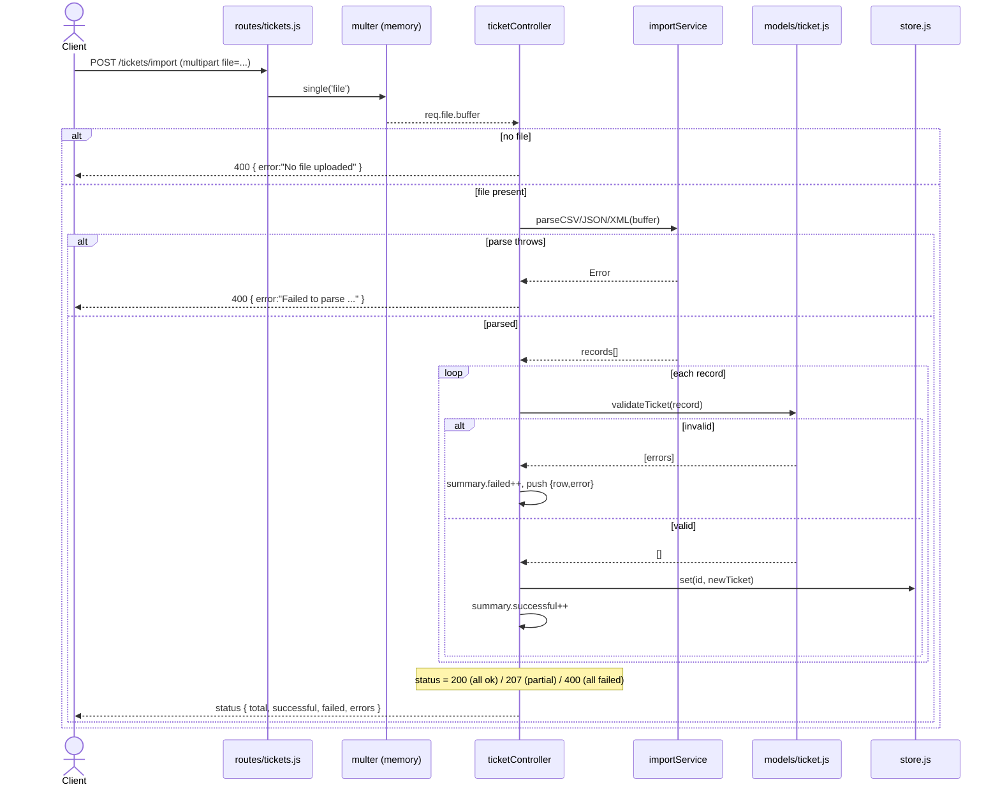
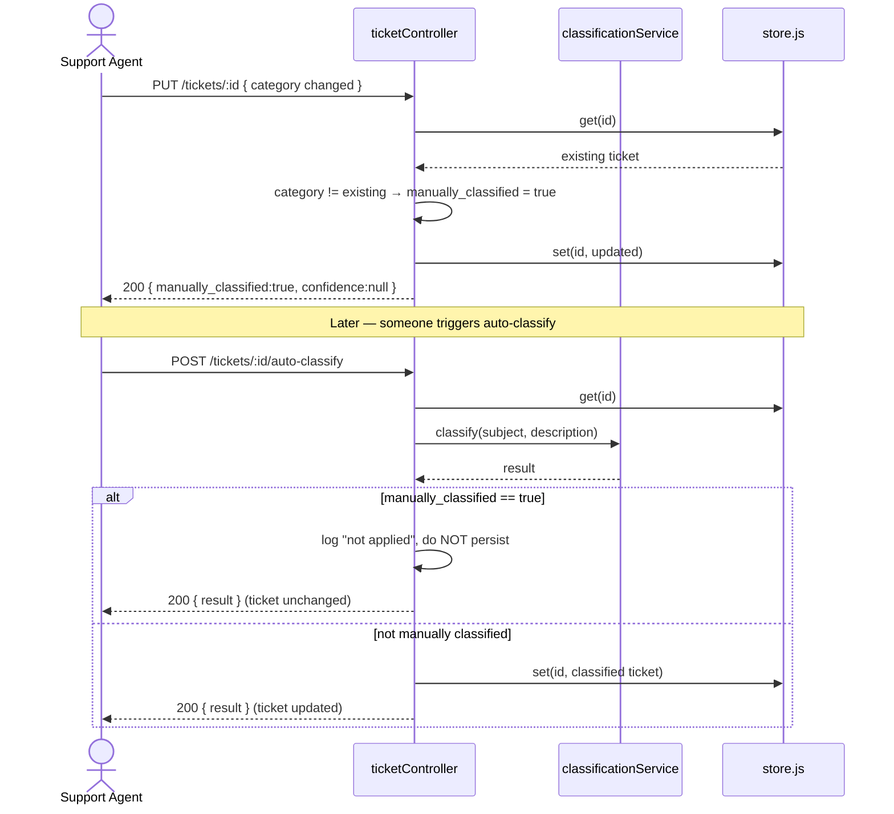

# 🏛️ Architecture — Customer Support Ticket System

> **Audience**: Technical Leads & Architects
> **Scope**: System structure, request flows, design rationale, and non-functional considerations

---

## 📑 Table of Contents

- [High-Level Architecture](#-high-level-architecture)
- [Component Descriptions](#-component-descriptions)
- [Data Flow Diagrams](#-data-flow-diagrams)
  - [Ticket Creation with Auto-Classification](#flow-1-ticket-creation-with-auto-classification)
  - [Bulk Import](#flow-2-bulk-import)
  - [Manual Override & Classification Lock](#flow-3-manual-override--auto-classify)
- [Design Decisions & Trade-offs](#-design-decisions--trade-offs)
- [Security Considerations](#-security-considerations)
- [Performance Considerations](#-performance-considerations)

---

## 🗺️ High-Level Architecture

The system is a stateless Express REST API following a layered (MVC-style) architecture. Each layer has a single responsibility and depends only on the layer directly beneath it.

---

## 🧩 Component Descriptions

| Component | File | Responsibility |
|-----------|------|----------------|
| **Express App** | `src/app.js` | Wires middleware (body parsing, static UI), mounts the `/tickets` router, and registers the global error handler. No business logic. |
| **Server Entry** | `src/server.js` | Binds the app to a port and starts listening. Kept separate from `app.js` so the app can be imported into tests without opening a socket. |
| **Ticket Router** | `src/routes/tickets.js` | Maps HTTP verbs + paths to controller handlers. Owns the `multer` in-memory upload config (10 MB limit) for the import endpoint. |
| **Ticket Controller** | `src/controllers/ticketController.js` | Orchestration layer: validates input, calls services, mutates the store, and decides HTTP status codes. Contains the request-flow logic but delegates all parsing/classification/validation. |
| **Import Service** | `src/services/importService.js` | Format-specific parsing (CSV via `csv-parse`, JSON native, XML via `xml2js`). Normalizes each format into a uniform plain-object shape (tags arrays, nested metadata, `auto_classify` coercion). |
| **Classification Service** | `src/services/classificationService.js` | Pure function: keyword-matching engine that returns `{ category, priority, confidence, reasoning, keywords_found }`. No I/O, no state. |
| **Ticket Model** | `src/models/ticket.js` | Enum constants (categories, priorities, statuses, sources, device types) and the `validateTicket()` function returning an array of error strings. |
| **Store** | `src/store.js` | A singleton `Map` keyed by ticket UUID. The single source of truth at runtime. |
| **Error Handler** | `src/middleware/errorHandler.js` | Express error middleware; converts thrown/`next(err)` errors into a JSON `{ error }` body with an appropriate status (defaults to 500). |

**Dependency direction**: Client → HTTP → Routing → Controller → {Services, Model, Store}. Services and the model never reach back up to the controller, and nothing below the controller touches Express `req`/`res` — keeping the domain layer framework-agnostic and unit-testable in isolation.

---

## 🔀 Data Flow Diagrams

### Flow 1: Ticket Creation with Auto-Classification

`POST /tickets` with `auto_classify: true`.

### Flow 2: Bulk Import

`POST /tickets/import` (multipart file). Note the per-row validation loop and the outcome-driven status code.

### Flow 3: Manual Override & Auto-Classify

Shows the interaction between a manual `PUT` and a later `auto-classify` — and the deliberate (non-sticky) classification lock.

---

## ⚖️ Design Decisions & Trade-offs

| Decision | Rationale | Trade-off / Consequence |
|----------|-----------|-------------------------|
| **In-memory `Map` store** | Zero setup, fast, ideal for the assignment's scope and deterministic tests. | No durability — data is lost on restart; no horizontal scaling (state is per-process). Swapping in a repository interface would be the first production change. |
| **`app.js` split from `server.js`** | Lets tests import the app with `supertest` without binding a port. | Minor extra file; negligible cost. |
| **Keyword-based classification (not ML)** | Transparent, deterministic, explainable (`reasoning` + `keywords_found`), no model hosting or latency. | Brittle to phrasing/synonyms; accuracy ceiling. Isolated as a pure function so it can be replaced by an LLM/ML service without touching the controller contract. |
| **Validation returns an array of strings** (not exceptions) | Enables reporting *all* problems at once and per-row aggregation during import. | Callers must remember to check `.length`; no typed error objects. |
| **`PUT` = full replacement** (not PATCH) | Simpler, predictable semantics; the whole ticket is revalidated. | Clients must send the complete body; partial updates aren't supported. |
| **`manually_classified` recomputed per `PUT`** | A human edit should suppress the *next* auto-classify from clobbering it. | The lock is **not sticky** — a subsequent no-op `PUT` resets it to `false`. Acceptable for current requirements; documented explicitly in `API_REFERENCE.md`. |
| **Import status codes: 200 / 207 / 400** | Communicates row-level outcome via HTTP semantics (`207 Multi-Status` for partial success). | Two distinct `400` body shapes (validation summary vs. `{error}`); consumers disambiguate via `errors` array vs. `error` string. |
| **`multer` memory storage** | Files never hit disk; simplest for parsing in-process. | Whole file held in RAM; the 10 MB cap bounds memory exposure. |
| **Pure, framework-agnostic domain layer** | Services/model don't touch `req`/`res`, so they unit-test trivially and could be reused behind a different transport (GraphQL, queue consumer). | Slightly more wiring in the controller. |

---

## 🔒 Security Considerations

- **Upload size limit**: `multer` caps uploads at **10 MB** (`routes/tickets.js`), bounding memory/DoS exposure from oversized files.
- **Input validation**: every write path (`POST`, `PUT`, and each imported row) runs `validateTicket()` — enforcing email format, string-length bounds, and enum whitelists before anything is stored. Enum whitelisting prevents arbitrary values in `category`/`priority`/`status`/metadata.
- **String coercion & trimming**: `newTicket()` coerces and trims string fields and lowercases emails, reducing inconsistent/whitespace-based data.
- **No injection surface (current)**: the store is an in-memory `Map`, so there is no SQL/NoSQL query construction from user input. **This must be revisited** when a real database is introduced — parameterized queries / an ORM would be required.
- **Error handler leakage**: `errorHandler.js` currently returns `err.message` and logs `err.stack`. For production, generic 5xx messages should be returned to clients (avoid leaking internals) while logging details server-side.
- **Gaps to close for production**: no authentication/authorization (any client can CRUD any ticket), no rate limiting, no CORS policy, and no audit trail beyond `console.log` classification logs. These are out of scope for the assignment but are the primary hardening backlog.

---

## ⚡ Performance Considerations

- **O(1) point operations**: create/get/update/delete are `Map` lookups/writes — constant time regardless of dataset size.
- **O(n) list & filter**: `GET /tickets` copies the map to an array and applies sequential `.filter()` passes per query param. Fine at current scale; would move to indexed queries in a real datastore. Measured well within budget (see below).
- **Classification is O(k)**: bounded by a small fixed keyword set over the concatenated subject+description — effectively constant per ticket.
- **Import is O(n·validation)**: linear in row count; each row validated and inserted independently, so one bad row never aborts the batch.
- **Synchronous parsing**: CSV/JSON parse synchronously; XML parses asynchronously (`xml2js` promise). All happen in-process on the event loop — acceptable given the 10 MB cap, but very large files would block the loop and are a candidate for streaming/worker offload at scale.
- **Statelessness**: no per-request shared mutable state beyond the store, so the design is inherently amenable to horizontal scaling *once* the store is externalized.

### Measured Benchmarks (from `tests/test_performance.test.js`)

| Operation | Target | Notes |
|-----------|--------|-------|
| Single ticket creation | < 100 ms | Includes validation |
| List 1000 tickets | < 500 ms | Full map → array serialization |
| Filter by category (100 tickets) | < 100 ms | Single `.filter()` pass |
| 20 concurrent create requests | < 2000 ms | Concurrency smoke test |
| Validate + create 100 tickets | < 2000 ms | Sequential throughput |

> These are upper-bound assertions enforced in CI, not average latencies — actual figures are typically well under target on modern hardware.
