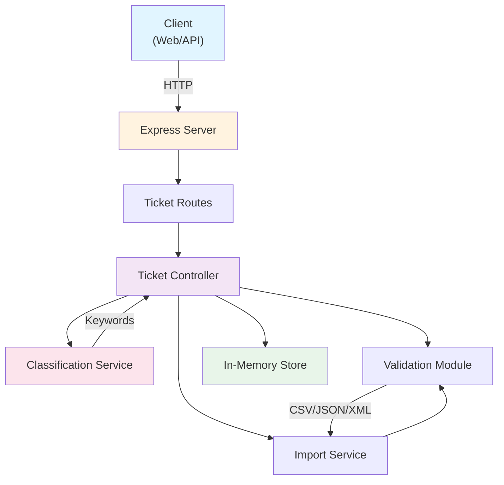
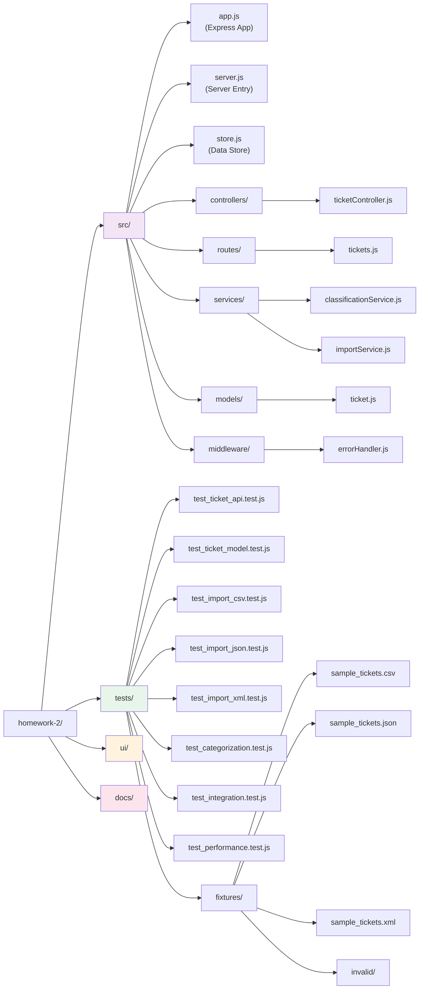

# 🎧 Homework 2: Intelligent Customer Support Ticket Management System

> **Build a scalable customer support system with AI-powered ticket classification**

A comprehensive REST API for managing customer support tickets with multi-format imports, automatic categorization, and priority assignment using keyword-based classification.

---

## 👤 Author

Ilya Chantsov ([@il4v](https://github.com/il4v)) — illia4v@gmail.com

---

## ✨ Key Features

- **Multi-Format Import**: Parse CSV, JSON, and XML ticket files with validation
- **Auto-Classification**: Intelligent ticket categorization and priority assignment
- **RESTful API**: Full CRUD operations with filtering and search capabilities
- **Data Validation**: Comprehensive validation for all ticket fields
- **High Test Coverage**: 93%+ code coverage with 77 comprehensive tests
- **Performance Optimized**: Handles 1000+ tickets efficiently with concurrent operations

---

## 🏗️ Architecture Overview



---

## 🗂️ Project Structure



---

## 🚀 Quick Start

### Prerequisites

- Node.js 16.x or higher
- npm 8.x or higher

### Installation

```bash
# Clone the repository
git clone <repository-url>
cd homework-2

# Install dependencies
npm install

# Start the development server
npm run dev

# Server will run on http://localhost:3000
```

### Environment Setup

Create a `.env` file (optional):
```bash
PORT=3000
NODE_ENV=development
```

---

## 🖥️ Front-End

**Stack**: plain HTML/CSS/JavaScript — no framework, no bundler, no build step (`ui/index.html`, `ui/css/style.css`, `ui/js/app.js`). It's served as static assets by the same Express app as the API (`express.static` in `src/app.js`) and talks to the REST API via `fetch`.

**Run it**: it starts automatically with the backend — no separate dev server needed.
```bash
npm install   # first time only
npm start     # or: npm run dev
# open http://localhost:3000 in a browser
```

**Features**: ticket list with filtering by category/priority/status, create/edit forms with client-side validation, ticket detail view with classification metadata, bulk import from CSV/JSON/XML with a per-row results summary, one-click auto-classification with category/priority/confidence/reasoning, and inline error/success feedback for all API operations.

---

## 📚 API Endpoints

### Ticket Management

| Method | Endpoint | Description |
|--------|----------|-------------|
| `POST` | `/tickets` | Create a new ticket |
| `GET` | `/tickets` | List all tickets (with filtering) |
| `GET` | `/tickets/:id` | Get a specific ticket |
| `PUT` | `/tickets/:id` | Update a ticket |
| `DELETE` | `/tickets/:id` | Delete a ticket |
| `POST` | `/tickets/import` | Bulk import tickets (CSV/JSON/XML) |
| `POST` | `/tickets/:id/auto-classify` | Auto-classify a ticket |

### Query Parameters

```
GET /tickets?category=account_access&priority=urgent&status=in_progress
```

Supported filters:
- `category`: account_access, technical_issue, billing_question, feature_request, bug_report, other
- `priority`: urgent, high, medium, low
- `status`: new, in_progress, waiting_customer, resolved, closed

---

## 🧪 Testing

### Run All Tests

```bash
# Run tests with coverage report
npm test

# Run tests in watch mode
npm run test:watch
```

### Test Coverage

Current coverage: **93.91%** (exceeds 85% requirement)

```
File                       % Stmts  % Branch  % Funcs  % Lines
──────────────────────────────────────────────────────────────
All files                    93.91     88.66    92.85    94.19
src/controllers              92.24     84.28      100    93.54
src/models                    100        100      100       100
src/routes                    100        100      100       100
src/services                  100        100      100       100
```

### Test Files (77 Tests Total)

| File | Tests | Coverage |
|------|-------|----------|
| test_ticket_api.test.js | 18 | API endpoints (CRUD, filtering, import status codes) |
| test_ticket_model.test.js | 16 | Validation rules |
| test_import_csv.test.js | 6 | CSV parsing & handling |
| test_import_json.test.js | 5 | JSON parsing |
| test_import_xml.test.js | 5 | XML parsing |
| test_categorization.test.js | 12 | Classification logic |
| test_integration.test.js | 10 | End-to-end workflows |
| test_performance.test.js | 5 | Performance benchmarks |

### Sample Test Data

Test fixtures are located in `tests/fixtures/`:
- `sample_tickets.csv` - 50 valid tickets
- `sample_tickets.json` - 20 valid tickets
- `sample_tickets.xml` - 30 valid tickets
- `invalid/` - Malformed data for negative tests

---

## 🛠️ Development Workflow

### Project Structure Details

```
src/
├── app.js                      # Express application setup
├── server.js                   # Server entry point
├── store.js                    # In-memory data store (Map)
├── controllers/
│   └── ticketController.js     # Request handlers for ticket operations
├── routes/
│   └── tickets.js              # API route definitions
├── services/
│   ├── classificationService.js # Ticket auto-classification logic
│   └── importService.js         # Multi-format file parsing
├── models/
│   └── ticket.js               # Validation & constants
└── middleware/
    └── errorHandler.js         # Global error handling
```

### Key Components

**Ticket Model** (`src/models/ticket.js`)
- Defines ticket data structure with all valid enums
- Validates email format, string lengths, and field values
- Enforces business rules for required fields

**Classification Service** (`src/services/classificationService.js`)
- Keyword-based categorization engine
- Priority level assignment with confidence scoring
- Returns reasoning and matched keywords

**Import Service** (`src/services/importService.js`)
- Parses CSV (csv-parse library)
- Parses JSON (native JSON)
- Parses XML (xml2js library)
- Normalizes data formats for unified processing

**Ticket Controller** (`src/controllers/ticketController.js`)
- Implements all CRUD operations
- Handles bulk imports with error reporting
- Optional auto-classification on ticket creation
- Manual classification override capability

---

## 📦 Dependencies

### Core Dependencies
- **express** (4.21.2) - Web framework
- **uuid** (11.1.0) - Unique ID generation
- **csv-parse** (5.5.6) - CSV parsing
- **xml2js** (0.6.2) - XML parsing
- **multer** (1.4.5) - File upload handling

### Development Dependencies
- **jest** (29.7.0) - Testing framework
- **supertest** (7.1.0) - HTTP assertions
- **nodemon** (3.1.9) - Development auto-reload

---

## 🎯 Key Features Explained

### Auto-Classification

The system uses keyword matching to automatically categorize and prioritize tickets:

```javascript
// Category detection
const CATEGORY_KEYWORDS = {
  account_access: ['login', 'password', '2fa', 'sign in', ...],
  technical_issue: ['bug', 'error', 'crash', 'broken', ...],
  billing_question: ['payment', 'invoice', 'refund', ...],
  // ... more categories
};

// Priority rules (ordered by severity)
const PRIORITY_KEYWORDS = [
  { level: 'urgent', keywords: ["can't access", 'critical', 'production down', ...] },
  { level: 'high', keywords: ['important', 'blocking', 'asap'] },
  // ... more levels
];
```

### Multi-Format Import

Support for three file formats with automatic parsing:

**CSV Format**
```csv
customer_id,customer_email,customer_name,subject,description,category,priority
cust-001,user@example.com,John Doe,Login issue,...
```

**JSON Format**
```json
[
  {
    "customer_id": "cust-001",
    "customer_email": "user@example.com",
    "customer_name": "John Doe",
    ...
  }
]
```

**XML Format**
```xml
<tickets>
  <ticket>
    <customer_id>cust-001</customer_id>
    <customer_email>user@example.com</customer_email>
    ...
  </ticket>
</tickets>
```

### Data Validation

Comprehensive validation includes:
- Email format validation
- String length constraints (subject: 1-200, description: 10-2000)
- Enum value validation (categories, priorities, statuses)
- Required field enforcement
- Metadata field validation

---

## 🔧 Configuration

### Jest Configuration

Tests are configured in `package.json`:

```json
{
  "jest": {
    "testEnvironment": "node",
    "collectCoverageFrom": ["src/**/*.js"],
    "coverageReporters": ["text", "lcov", "html"],
    "coverageDirectory": "coverage"
  }
}
```

### Coverage Targets

- **Statements**: 93.91%
- **Branches**: 88.66%
- **Functions**: 92.85%
- **Lines**: 94.19%

---

## 📝 Examples

### Create a Ticket

```bash
curl -X POST http://localhost:3000/tickets \
  -H "Content-Type: application/json" \
  -d '{
    "customer_id": "cust-123",
    "customer_email": "user@example.com",
    "customer_name": "John Doe",
    "subject": "Cannot login",
    "description": "I cannot access my account after password reset",
    "auto_classify": true
  }'
```

### List Tickets with Filtering

```bash
curl http://localhost:3000/tickets?category=account_access&priority=urgent
```

### Import Tickets from CSV

```bash
curl -X POST http://localhost:3000/tickets/import \
  -F "file=@sample_tickets.csv"
```

### Auto-Classify a Ticket

```bash
curl -X POST http://localhost:3000/tickets/{ticket-id}/auto-classify
```

---

## 🧠 Technologies & Patterns

### Design Patterns Used

- **MVC Pattern**: Separation of models, controllers, and routes
- **Service Layer**: Business logic isolated in services
- **Factory Pattern**: Ticket object creation with validation
- **Singleton Pattern**: In-memory store instance

### Architecture Principles

- **Separation of Concerns**: Each module has a single responsibility
- **DRY (Don't Repeat Yourself)**: Shared validation and utilities
- **Stateless Operations**: Each request is independent
- **Error Handling**: Comprehensive error responses with meaningful messages

---

## 📈 Performance Characteristics

Based on performance tests:

- **Single Ticket Creation**: < 100ms
- **List 1000 Tickets**: < 500ms
- **Filter by Category**: < 100ms
- **20 Concurrent Requests**: < 2000ms

---

## 🐛 Troubleshooting

### Common Issues

**Port Already in Use**
```bash
# Change port in environment
PORT=3001 npm run dev
```

**Test Failures**
```bash
# Clear Jest cache and re-run
npx jest --clearCache
npm test
```

**Import Parsing Errors**
- Ensure CSV has correct headers
- JSON must be an array of objects
- XML root element must be `<tickets>`

---

## 📚 Additional Resources

- API Reference: See `API_REFERENCE.md`
- Architecture Details: See `ARCHITECTURE.md`
- Testing Guide: See `TESTING_GUIDE.md`
- Full Task Description: See `TASKS.md`

---

## 📄 License

This project is part of an educational assignment.

---

**Last Updated**: July 2026  
**Status**: ✅ Complete with 93.91% Test Coverage
