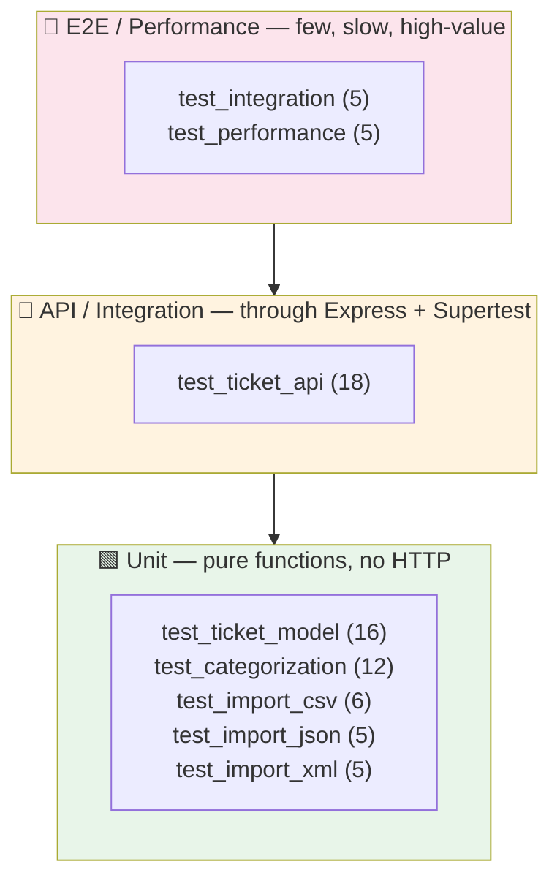

# 🧪 Testing Guide — Customer Support Ticket System

> **Audience**: QA Engineers
> **Test framework**: Jest + Supertest
> **Current status**: 72 automated tests, 8 suites, **91.63%** statement coverage

---

## 📑 Table of Contents

- [Test Pyramid](#-test-pyramid)
- [How to Run Tests](#-how-to-run-tests)
- [Test Suite Overview](#-test-suite-overview)
- [Sample Test Data Locations](#-sample-test-data-locations)
- [Manual Testing Checklist](#-manual-testing-checklist)
- [Performance Benchmarks](#-performance-benchmarks)
- [Coverage Report](#-coverage-report)

---

## 🔺 Test Pyramid

The suite follows the classic pyramid: a broad base of fast unit tests over pure functions, a middle band of API/integration tests through the HTTP layer, and a thin top of end-to-end lifecycle and performance checks.



| Layer | Suites | Tests | Speed | What it proves |
|-------|--------|-------|-------|----------------|
| **Unit** (base) | model, categorization, import_csv/json/xml | 44 | fast | Validation rules, parsing, and classification logic in isolation |
| **API/Integration** (middle) | ticket_api | 18 | medium | Endpoints return correct status codes + bodies through the real Express stack |
| **E2E / Performance** (top) | integration, performance | 10 | slower | Full lifecycle workflows and latency/throughput budgets |

**Total: 72 tests across 8 suites.**

---

## ▶️ How to Run Tests

```bash
# Install dependencies (first time only)
npm install

# Run the full suite with coverage
npm test

# Watch mode — reruns on file changes (TDD loop)
npm run test:watch
```

### Targeted runs

```bash
# A single suite by path
npx jest tests/test_ticket_api.test.js

# By test-name pattern (across all suites)
npx jest -t "returns 207"

# One suite, verbose, no coverage (faster feedback)
npx jest tests/test_categorization.test.js --verbose --coverage=false
```

### Interpreting output

- Green `PASS` / red `FAIL` per suite, then a coverage table, then a summary line (`Tests: 72 passed, 72 total`).
- Classification `console.log` lines (e.g. `[classify] ticket ... → category=...`) are expected application logs, **not** test failures.
- An HTML coverage report is written to `coverage/lcov-report/index.html` — open it in a browser to see line-by-line highlighting.

---

## 🗂️ Test Suite Overview

| Suite | Tests | Focus |
|-------|-------|-------|
| `test_ticket_api.test.js` | 18 | All CRUD endpoints, filtering, and the import status-code matrix (200/207/400) |
| `test_ticket_model.test.js` | 16 | `validateTicket()`: required fields, email format, length bounds, enum whitelists, metadata |
| `test_categorization.test.js` | 12 | Category detection, priority rules, confidence scoring, reasoning/keywords output |
| `test_import_csv.test.js` | 6 | CSV parsing: headers, `\|`-delimited tags, flattened metadata, `auto_classify` coercion, trimming |
| `test_import_json.test.js` | 5 | JSON array parsing, non-array rejection, nested metadata/tags |
| `test_import_xml.test.js` | 5 | XML parsing, single vs. multiple tickets, nested `<tags>`/`<metadata>` |
| `test_integration.test.js` | 5 | Full lifecycle, bulk import + filter, concurrent ops, combined filtering, auto-classify endpoint |
| `test_performance.test.js` | 5 | Latency/throughput budgets (see [benchmarks](#-performance-benchmarks)) |

---

## 📁 Sample Test Data Locations

All fixtures live under `tests/fixtures/`.

### Valid data (happy-path imports)

| File | Records | Format |
|------|---------|--------|
| `tests/fixtures/sample_tickets.csv` | 50 | CSV with pipe-delimited tags + `metadata_*` columns |
| `tests/fixtures/sample_tickets.json` | 20 | JSON array with nested `metadata` and `tags[]` |
| `tests/fixtures/sample_tickets.xml` | 30 | XML `<tickets><ticket>…` with nested `<tags>`/`<metadata>` |

### Invalid data (negative tests)

| File | Purpose |
|------|---------|
| `tests/fixtures/invalid/malformed.csv` | Rows with bad email, missing subject/name/id — exercises per-row validation failures |
| `tests/fixtures/invalid/malformed.json` | A single object (not an array) — triggers the "must be an array" parse rejection |
| `tests/fixtures/invalid/malformed.xml` | Tickets with empty required fields — exercises validation failures during XML import |

Most unit/API tests build their input inline (small `Buffer.from(...)` payloads) for clarity; the fixture files are used for larger/manual import scenarios and negative-path verification.

---

## ✅ Manual Testing Checklist

Use this before sign-off or when smoke-testing a running instance (`npm start`, then `http://localhost:3000`). cURL examples are in `API_REFERENCE.md`.

### Ticket CRUD
- [ ] `POST /tickets` with a valid body → **201** and a generated `id`, `created_at`, `status:"new"`.
- [ ] `POST /tickets` missing required fields → **400** with an `errors` array listing each problem.
- [ ] `POST /tickets` with a malformed email → **400** mentioning email validity.
- [ ] `POST /tickets` with `auto_classify:true` → response has a non-null `category` and `classification_confidence`.
- [ ] `GET /tickets` → **200** and an array (empty `[]` when none exist, **not** 404).
- [ ] `GET /tickets/:id` for an existing id → **200** with the full ticket.
- [ ] `GET /tickets/:id` for an unknown id → **404** `{ error: "Ticket not found" }`.
- [ ] `PUT /tickets/:id` full body → **200** with updated fields and a bumped `updated_at`.
- [ ] `PUT` setting `status:"resolved"` (first time) → `resolved_at` is populated.
- [ ] `PUT` moving away from resolved/closed → `resolved_at` clears back to `null`.
- [ ] `DELETE /tickets/:id` → **204** with no body; a subsequent `GET` returns **404**.

### Filtering
- [ ] `GET /tickets?category=account_access` → only matching tickets.
- [ ] `GET /tickets?priority=urgent` → only matching tickets.
- [ ] `GET /tickets?status=in_progress` → only matching tickets.
- [ ] Combined `?category=…&priority=…&status=…` → intersection of all three.

### Bulk Import
- [ ] Import a fully valid file → **200**, `failed:0`, `successful == total`.
- [ ] Import a file with *some* bad rows → **207**, with `errors[]` naming the failing rows.
- [ ] Import a file where *every* row is invalid → **400** with the summary body (note the `errors` array, not a single `error`).
- [ ] Import with no file attached → **400** `{ error: "No file uploaded" }`.
- [ ] Import a `.txt` (unsupported) → **400** `{ error: "Unsupported file format: .txt" }`.
- [ ] Import a syntactically broken file → **400** `{ error: "Failed to parse …" }`.
- [ ] Import a `.csv`, `.json`, and `.xml` fixture → each parses and counts correctly (50 / 20 / 30).

### Classification
- [ ] `POST /tickets/:id/auto-classify` on an unclassified ticket → applies and persists category/priority.
- [ ] Response includes `confidence` (0–1), `reasoning`, and `keywords_found`.
- [ ] After a manual `PUT` changing category/priority (`manually_classified:true`), `auto-classify` returns a result but does **not** overwrite the stored ticket.
- [ ] A text with an "urgent" keyword (e.g. "production down") → `priority:"urgent"`.
- [ ] A text with no known keywords → `category:"other"`, `priority:"medium"`, `confidence:0`.

---

## 📊 Performance Benchmarks

Enforced as upper-bound assertions in `tests/test_performance.test.js`. Failing any of these fails CI.

| Benchmark | Budget | Scenario |
|-----------|--------|----------|
| Single ticket creation | **< 100 ms** | One `POST /tickets` incl. validation |
| List 1000 tickets | **< 500 ms** | `GET /tickets` after seeding 1000 records |
| Filter by category | **< 100 ms** | `GET /tickets?category=…` over 100 records |
| 20 concurrent creates | **< 2000 ms** | 20 parallel `POST` requests via `Promise.all` |
| Validate + create 100 tickets | **< 2000 ms** | Sequential throughput of 100 creates |

> These are ceilings, not expected latencies. On typical dev hardware real numbers sit well below budget; the assertions exist to catch regressions (e.g. an accidental O(n²) filter).

---

## 📈 Coverage Report

Run `npm test` to regenerate. Current snapshot:

| Metric | Coverage |
|--------|----------|
| Statements | **91.63%** |
| Branches | **82.66%** |
| Functions | **92.85%** |
| Lines | **92.41%** |

Fully covered (100%): `app.js`, `store.js`, `routes/tickets.js`, `models/ticket.js`*, `services/classificationService.js`, `services/importService.js`.

Intentionally uncovered:
- `server.js` — the port-binding entry point (not exercised in tests by design; the app is imported directly).
- `middleware/errorHandler.js` — the global 500 fallback path (only reached on unhandled exceptions).

\* `ticket.js` shows 96.87% branch coverage (one defensive metadata branch).

**Requirement**: > 85% overall — **met** (91.63%). A screenshot of the coverage output belongs in `docs/screenshots/test_coverage.png`.

### Regenerating the HTML report

```bash
npm test                       # writes coverage/ (text + lcov + html)
open coverage/lcov-report/index.html   # macOS; use xdg-open on Linux
```
